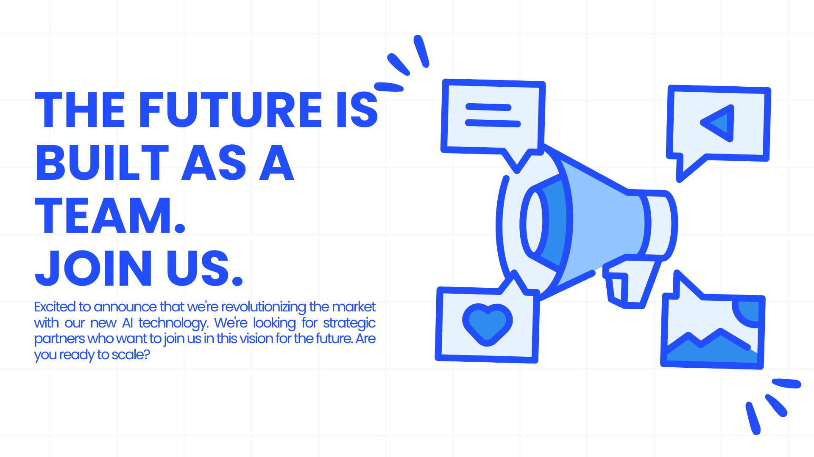

# Postslify: Master LinkedIn with the Power of AI 🚀

**Stop struggling with writer's block. Start building your personal brand today.**

Postslify is the ultimate platform for professionals and companies looking to scale their LinkedIn presence without sacrificing authenticity. Our Artificial Intelligence technology doesn't just write for you; it writes *like you*.

---

## 💎 Why Postslify?

In today's competitive professional world, your personal brand is your most valuable asset. But creating quality content consistently is exhausting.

*   ❌ Spending hours staring at a blank screen?
*   ❌ Struggling to maintain a consistent tone of voice?
*   ❌ Don't know the best time to post?

**Postslify is your solution.** We automate the tedious work so you can focus on what matters: connecting and growing.

---

## 🔥 Features that Power Your Growth

### 🧠 **AI That Understands You**
No more generic content. Train our AI with your best posts and create personalized **Voice Profiles**. Whether you need an executive, inspirational, or technical tone, Postslify adapts to you.

### ✍️ **Viral Content Generation**
Create posts, threads, and articles optimized for the LinkedIn algorithm in seconds. From vague ideas to posts ready to go viral.

### 🎨 **Integrated Creative Studio**
A picture is worth a thousand words. Generate impactful, royalty-free visuals to accompany your texts, all without leaving the platform.

### 📅 **Smart Scheduling**
Organize your editorial calendar weeks in advance. Our system schedules your posts for maximum impact times.

### 🌍 **Global Reach**
Break language barriers. Create and translate native content in **Spanish and English** to reach international audiences.

---

## 🚀 Join the Personal Branding Revolution

Thousands of professionals are already using AI to stand out. Don't get left behind and take your LinkedIn profile to the next level.

**✨ [Try Postslify Now](#) ✨**

---

### 📩 Need help?
Have questions or suggestions? We are here to help you grow.
Write to us at: **support@postslify.com**

---
© 2026 Postslify. All rights reserved.
